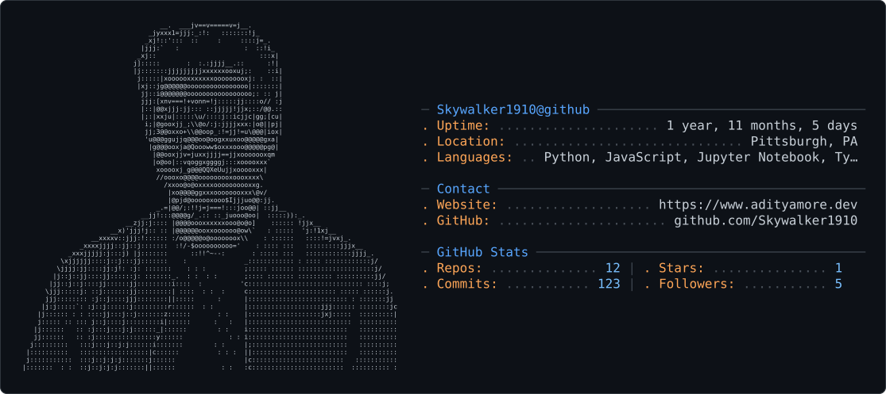

<picture>
  <source media="(prefers-color-scheme: dark)" srcset="dark_mode.svg" />
  <source media="(prefers-color-scheme: light)" srcset="light_mode.svg" />
  
</picture>

  
  
  
  

---

## Live systems

Deployed and running, not just committed.

- **[Tech Portfolio + BB-8 co-pilot](https://www.adityamore.dev)** — `live` · [source](https://github.com/Skywalker1910/Tech-Portfolio) · [static mirror](https://skywalker1910.github.io/Tech-Portfolio/)  
  SSR portfolio with a RAG co-pilot grounded in verified profile data, a private command center for content and RAG indexing, and consent-aware first-party analytics that never store raw IPs or chat text.  
  `Next.js 16` `React 19` `TypeScript` `Tailwind v4` `OpenAI Responses + Embeddings` `Amazon S3 Vectors` `DynamoDB` `AWS Amplify SSR` `Route 53`

- **[FIFA World Cup 2026](https://game.adityamore.dev)** — `game.adityamore.dev` · [source](https://github.com/Skywalker1910/FIFA-World-Cup-2026)  
  Prediction platform for a private group: two regional game servers from one deployment, per-match prediction locking, ledger and public leaderboards, admin command center, API-Football score sync.  
  `Node 24 (zero dependencies, node:http)` `SQLite` `Docker` `Railway`

- **[FIFA 2026 AI Agents](https://github.com/Skywalker1910/FIFA-World-Cup-2026-AI-Agents)** — `runs against` [game.adityamore.dev](https://game.adityamore.dev)  
  Companion service where agents authenticate as their own player accounts, reason over fixtures, and submit predictions with score forecasts, confidence, and rationale that are scored against real results.  
  `Node` `OpenAI` `Claude` `Gemini`

- **[Neural Log](https://neurallog.adityamore.dev)** — `live` · [source](https://github.com/Skywalker1910/Neural-Log)  
  Activity tracking system with an auditable XP ledger, training/nutrition/habit analytics, and calendar heatmaps that distinguish a missed day from an unobserved one.  
  `Flask + Gunicorn` `React (Vite)` `SQLite` `Docker Compose` `Caddy` `AWS Lightsail`

## Research

**Researcher — LLM Agents & Human Behavior**, School of Computing, Clemson University _(May 2026 – present, advised by Dr. Long Cheng)_

Investigating whether LLM agents can realistically simulate human behavior, and how behavioral fidelity can be evaluated systematically — surveying AgentSociety, YuLan-OneSim, Generative Agents and related multi-agent simulation work, and building evaluation methodology for AI-generated synthetic populations.

## Engineering & ML work

- **[BB8 — transformer LM from scratch](https://github.com/Skywalker1910/BB-8)**  
  GPT-style decoder built weight by weight: character/word/BPE tokenization, attention, training loop, decoding strategies, evaluation and explainability.  
  `Python` `PyTorch`

- **[LLM defense evaluation](https://github.com/Skywalker1910/Evaluating-Defense-Mechanisms-Jailbreak-LLMs)**  
  Automated jailbreak and defense pipelines benchmarking attack success rate, refusal behavior, response consistency and latency across multiple models and attack strategies.  
  `Python` `adversarial ML` `AI security`

- **[Movie recommendation engine](https://github.com/Skywalker1910/Movies-Recommendation-Engine)**  
  Collaborative filtering, content-based and neural recommenders over 26M+ ratings and 45K movies; FunkSVD reached **RMSE 0.76**, ~21% better than baseline, on sparse-matrix-optimized ETL.  
  `Python` `scikit-learn` `PyTorch` `Flask` `PostgreSQL` `Docker`

- **[Deep learning coursework](https://github.com/Skywalker1910?tab=repositories&q=CPSC-8430)**  
  CPSC 8430 assignment series — architectures, training dynamics and evaluation implemented end to end rather than called from a library.  
  `Python` `PyTorch` `Jupyter`

## Toolchain

| Layer | Tools |
| --- | --- |
| Languages |     |
| ML / DL |       |
| LLM / RAG |     |
| Web |      |
| Cloud & infra |       |

## Repo signals

  
  
  

| Repo | Top language | Commits (1y) | Last commit |
| --- | --- | --- | --- |
| [`Tech-Portfolio`](https://github.com/Skywalker1910/Tech-Portfolio) |  |  |  |
| [`FIFA-World-Cup-2026`](https://github.com/Skywalker1910/FIFA-World-Cup-2026) |  |  |  |
| [`Neural-Log`](https://github.com/Skywalker1910/Neural-Log) |  |  |  |
| [`BB-8`](https://github.com/Skywalker1910/BB-8) |  |  |  |

Every badge above is read live from the GitHub API at render time — nothing here is hand-maintained.

---

  Open to <strong>AI Engineer</strong>, <strong>Machine Learning Engineer</strong> and <strong>Data Scientist</strong> roles ·
  <a href="https://www.adityamore.dev">adityamore.dev</a> ·
  <a href="https://www.linkedin.com/in/more-aditya">LinkedIn</a> ·
  <a href="mailto:aditya.more@outlook.in">aditya.more@outlook.in</a>
   
  The card above is generated by <a href="generate_card.py"><code>generate_card.py</code></a> — edit the spec, re-run, both themes stay in sync.

